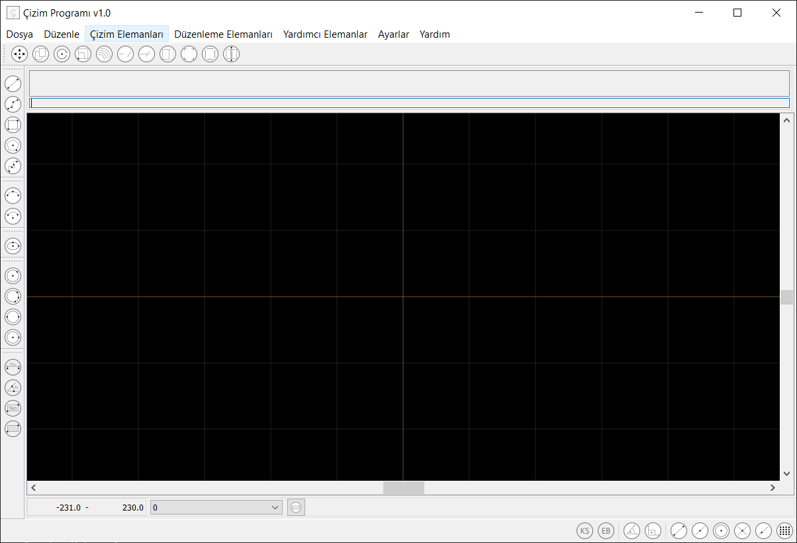

## CAD Programı
---------------------
Python kullanarak yazdığım çizim programında klavye ve mouse kullanarak komut verilip temel düzeyde teknik çizimler yapılabilmektedir.Yapılan bu çizimler .cpd (programın kendi kayıt formatı) ve .dxf formatında kayıt edilebilmektedir.

[Programın videosunu youtubeden izleyebilirsiniz.](https://youtu.be/kdz4b9l1CcQ)



-------------------
#### Komutlar:
#### Çizim Komutları
* __Çizgi__
  - Çizgi
    ```
    Fare ile tiklanılan iki nokta arasına veya 
    klavye ile verilen iki nokta arasına çizgi çizer
    
    ```
  - Sürekli Çizgi
    ```
    Fare ile tiklanılan noktalara veya 
    klavye ile verilen koordinatlara çizgi sürekli çizgi çizer
    ```
* __Çember__
  - Merkez Yarıçap
    ```
    Klavya veya fare ile verilen koordinatların birincisi merkez noktası 
    olur.İkinci verilen nokta ile birinci nokta arasındaki 
    mesafeyi hesaplar ve yarıçapı bulur sonrasında çemberi çizer.
    ```
  - 3 Nokta
    ```
    Klavya veya fare ile verilen 3 adet koordinattan çizilebilecek 
    çemberin merkez noktasını ve yarıçapını hesaplar ve çizer.
    ```
  - 2 Nokta
    ```
    Klavya veya fare ile verilen 2 adet koordinatı çemberin iki uç noktası 
    olur.Bu noktalardan çemberin yarıçap ve merkezini hesaplar ve çizer. 
    ```
* __Dikdörtgen__ 
    ```
    Klavya veya fare ile verilen 2 adet koordinatı dikdörtgenin iki uc noktası 
    olarak hesaplar ve dikdörtgen çizer.
    ```
* __Yay__
    ```
    Klavya veya fare ile verilen 3 adet koordinattan çizilebilecek 
    çemberin merkez noktasını ve yarıçapını hesaplar.
    Sonrasında bu noktalardan yayın baslama ve bitiş açılarınıda hesaplayıp 
    çizimi yapar.
    ```
* __Elips__
    ```
    Klavya veya fare ile verilen 2 adet koordinattan çizilebilecek 
    elipsi hesaplar ve çizer.
    ```
#### Düzenleme Komutları
* __Hareket__
    ```
    Seçili olan çizim elemanlarını verilen 2 koordinat 
    arasındaki mesafeyi hesaplayıp bu mesafeye göre hareket ettirir.
    ```
* __Kopyalama__
    ```
    Seçili olan çizim elemanlarını verilen 2 koordinat 
    arasındaki mesafeyi hesaplayıp bu mesafeye göre kopyalar.
    ```
* __Ölçekleme__
    ```
    Seçili olan çizim elemanlarını verilen 2 koordinat 
    arasındaki mesafeyi hesaplayıp bu mesafeye göre ölçekler.
    ```
#### Yardımcı Komutlar
* __Uç Nokta Yakalama__
    ```
    Fare elemanların üzerine geldiğinde,farenin bulunduğu konumdaki elemanların 
    uç noktaları arasında en yakın olanı hesaplar ve tıklama yapıldığında 
    otomatik olarak bu noktayı seçer.
    ```
* __Orta Nokta Yakalama__
    ```
    Fare elemanların üzerine geldiğinde,farenin bulunduğu konumdaki elemanların 
    orta noktaları arasında en yakın olanı hesaplar ve tıklama yapıldığında 
    otomatik olarak bu noktayı seçer.
    ```
* __Merkez Noktası Yakalama__
    ```
    Fare elemanların üzerine geldiğinde,farenin bulunduğu konumdaki elemanların 
    merkez noktaları arasında en yakın olanı hesaplar ve tıklama yapıldığında 
    otomatik olarak bu noktayı seçer.
    ```
* __Dik Çizme Modu__
    ```
    Çizim yapılırken en son tıklanılan koordinata sadece dik 
    uzaklıkta olan noktaların seçilmesine izin verir.
    ```
* __Katmanlar__
    ```
    Çizilen elemanları gruplar ve elemanların rengi,çizgi kalınlığı,
    çizgi tipi yönetilebilir.Aynı katmanda olan elemanları gizleyebilir ve 
    seçilemez hale getirebilir.
    ```

Program komut paneli ile yönetilmekte.Komut paneline klavye veya tıklayarak verilen komutlar ilgili sınıf ve fonksiyonları tetiklemektedir.


